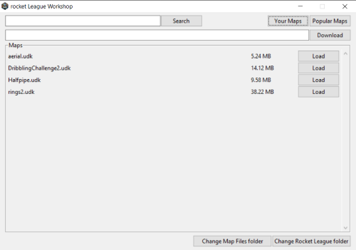
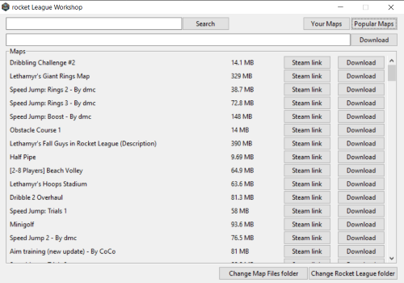

# Rocket League Workshop

## What is it?
Rocket League Workshop is a desktop app made with Tkinter, for loading and downloading Rocket League Workshop maps from steam workshop for those who play Rocket League on Epic Games.

## Installation
To install the app you have to download setup at first.
Run the setup, ignore the warning from Windows Smart Screen if it pops up.  
**Please do NOT save the app to Program Files or Program Files (x86).**
[**Direct Download link**](https://github.com/themm1/Rocket-League-Workshop/releases/download/v1.0/rlworkshop_setup.exe)

## App Configuration
As the program starts for the first time it automatically tries to locate your Rocket League folder. If it fails, locate your Rocket League folder manually by clicking a button in bottom right corner and than selecting the folder. Select maps folder 
(usually `something/rocketleague/TAGame/CookedPCConsole`), NOT the `something/rocketleague/` folder.  
You can also change the location and name of the `Map Files` directory by clicking the other button in bottom right corner and than selecting some folder. If there are some maps in your Map Files folder the program cuts and pastes all of the maps to folder you select.

## Usage
At first you have to download some maps by pasting their url to download box or by downloading them from the `Popular Maps`.
All maps you download from the application are automatically added to your Map Files folder. To load map you have to switch to `Your Maps` and just click the load button right next to the map you want to play.  
To actually play the map just play `Underpass` in freeplay maps and it's done!

## Examples

